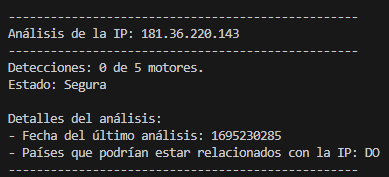

Descripción
------------------------------
Este script en Python permite consultar un conjunto de direcciones IP en la base de datos de VirusTotal para determinar su estado de seguridad, verificando si han sido marcadas como maliciosas o sospechosas por diversos motores de detección. La información obtenida se presenta de forma organizada, detallando el estado de cada IP y los motores de análisis que la consideran maliciosa o sospechosa.

************Características************

- Consulta la base de datos de VirusTotal utilizando la API de su plataforma.

- Verifica múltiples direcciones IP y proporciona un resumen de su análisis.

- Muestra la cantidad de motores de análisis que detectan la IP como maliciosa o sospechosa.

- Imprime información relevante, como el número de detecciones, estado de seguridad, motores de detección afectados y detalles del análisis.

************Requisitos************
- Python 3.12 a

- Módulos de Python: requests, json, time

- Clave de API de VirusTotal (incluida en el script, pero debe ser segura en implementaciones reales).
----------------------------------
************Instalación************
----------------------------------
``` bash
git clone https://github.com/Andrix300/Verificador-IPs-VirusTotal.git 
cd Verificador-IPs-VirusTotal
pip install -r requeriments.txt
```
--------------------------
Uso
--------------------------

En el apartado de API_KEY =  colocar tu propia clave de API de VirusTotal en la variable API_KEY.

Agrega o modifica las direcciones IP que quieres verificar en la lista ips dentro del script.

Ejecuta el script desde la línea de comandos con:

python VerificadorIPsVirusTotal.py

-----
Funcionamiento
-
El script sigue los siguientes pasos:

Autenticación: Se autentica con la API de VirusTotal utilizando la clave proporcionada.

Consulta de IPs: Hace una solicitud GET a la API para cada dirección IP en la lista.

Manejo de Respuestas: Procesa la respuesta y extrae información clave como el número de motores que marcan la IP como maliciosa o sospechosa.

Impresión de Resultados: Muestra los resultados en la consola, incluyendo detalles del análisis y la fecha del último análisis.

Pausa entre Consultas: Usa time.sleep(15) para respetar el límite de consultas de la API.

---
Ejemplo de Salida
-



---
Notas
--------

Importante: La clave de API de VirusTotal debe manejarse con cuidado y no compartirse públicamente.

El tiempo de espera (time.sleep(15)) puede ajustarse dependiendo de las restricciones de tu cuenta en VirusTotal.
